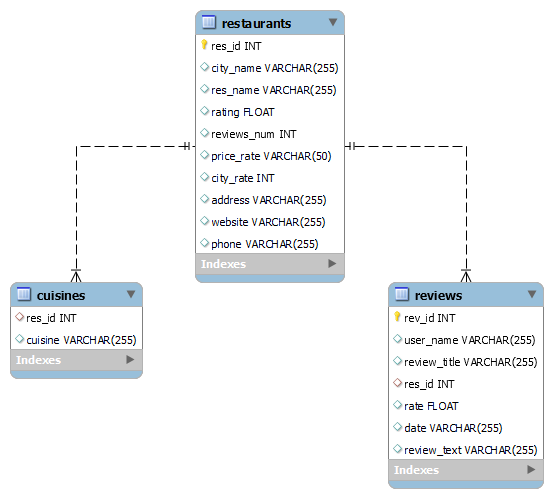

# Web Scraping Project
### First project from the ITC program
Creators: Sahar G. | Bar I. | Omer C.  

Main project purpose:  
&emsp;Create an easy-to-read db of restaurants in chosen cities.  
&emsp;The db will contain 3 tables: restaurants, cuisines, reviews.     
&emsp;See ERD below for tables contents.

By using the ```tripadvisor_scraper.py```  you can insert list of cities and number of pages per city (max 30 restaurants per page).  
and it will insert desired data to db tables.    
The arguments of ```tripadvisor_scraper.py``` are as follows:
* <span style="color: red">cities</span> - name of the desired cities, ```-c "city_1" "city_2"```
* <span style="color: red">pages</span> - Number of restaurants pages to scrape per city ```-p #num```

####Initial Configuration:
First time initialization:
 - Install requirements.txt ```pip install -r requirements.txt```
 - Edit db_config.py ```USERNAME``` and ```PASSWORD``` with local MySQL configuration
 - Edit config.py ```USERNAME``` and ```PASSWORD``` with local MySQL configuration
 - Create local db by running ```create_db.py```

Run ```tripadvisor_scraper.py -c "city_1" "city_2" etc -p #num#```

